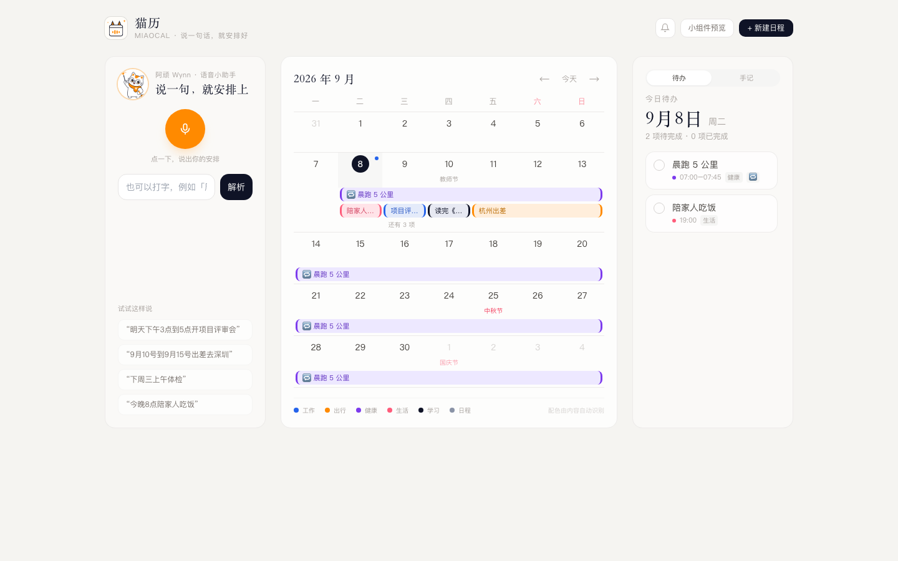
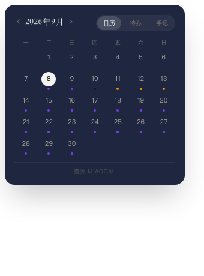
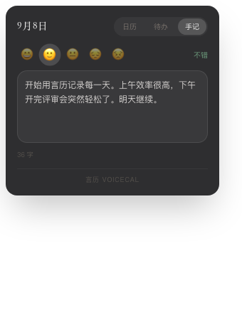

# 猫历 MiaoCal · 语音智能日历

> 说一句话，就安排好。顽皮猫 Naughty Cat 品牌旗下的语音智能日历 / To-do 应用。


## 品牌

顽皮猫品牌基因：活力橙 `#FF8A00` / 深夜蓝 `#0F1326` / 科技蓝 `#2563EB` / 探索紫 `#7C3AED`。

- Logo：自创「猫耳日历」—— 深夜蓝线稿日历 + 橙底猫耳 + 语音声波 + 引导棒星星
- 语音小助手 IP：阿顽 Wynn（先锋领航者，官方形象提取自品牌手册）
- 事件分类色对应 IP 家族：工作·科技蓝 / 出行·活力橙 / 健康·探索紫 / 学习·深夜蓝 / 生活·暖橙红

## 功能

- **语音小助手**：点麦克风说「明天下午3点到5点开项目评审会」「9月10号到15号出差去深圳」，
  自动识别时间、持续区间与事件内容，预览确认后写入日历（也可键盘输入）
- **重复日程**：说「每周五下午3点站会」「每天早上7点跑步」「每月15号还花呗」即可创建；
  日历上同一周的连续重复自动合并为一条 🔁 色带
- **本地提醒**：点右上角铃铛开启后，定时日程开始前 10 分钟推送系统通知
- **月历视图**：中国公历 + 农历节日标注（2025–2028），跨天事件自动渲染为连续彩色条（首尾对称色帽）
- **智能配色**：按内容自动分类着色（工作 / 出行 / 健康 / 生活 / 学习 / 日程）
- **今日待办**：右侧当日清单，圆圈打卡完成，点击可编辑 / 删除
- **每日手记**：右侧面板「手记」Tab，心情五档速记 + 正文自动保存 + 语音听写；
  有手记的日期在月历右上角显示心情色标记点
- **桌面小组件**：无边框置顶悬浮窗，三种形态一键切换 —— 迷你月历（‹ › 翻页、点选日期、日程打点）/
  今日待办（跟随选中日期）/ 今日手记（心情速记 + 随笔）
- **本地持久化**：数据存于 localStorage，主窗口与小组件实时同步，重启不丢

## 截图

| 主界面 | 桌面小组件 · 日历 | 桌面小组件 · 手记 |
| --- | --- | --- |
|  |  |  |

## 技术栈

- React 19 + TypeScript + Vite + Tailwind CSS + shadcn/ui
- 中文自然语言日期解析：`chrono-node`（zh-hans）+ 自研规则层
  （上午/下午/晚上时段、A到B 区间、星期表达式、时刻区间、重复规则、标题抽取、语义配色）
- 语音识别：Web Speech API（`zh-CN`）
- 桌面化：Electron（主窗口 + 无边框透明置顶小组件窗口 + 系统托盘）

## 开发

```bash
npm install
npm run dev          # 浏览器开发预览 http://localhost:7100
npm run electron:dev # 桌面应用开发模式（Vite 热更新 + Electron）
```

## 打包分发（生成可下载的安装包）

```bash
npm run dist:mac   # macOS → release/ 下生成 .dmg / .zip
npm run dist:win   # Windows（需在 Windows 或 CI 上执行）→ .exe 安装包 / 便携版
```

打包产物即可上传到 GitHub Releases / 网盘供他人下载安装。

## 桌面小组件

- 系统托盘图标右键 →「桌面小组件」，或直接以小组件模式启动：
  ```bash
  electron . --widget
  ```
- 小组件为无边框透明窗体，按住卡片拖动位置，右上角切换「日历 / 待办 / 手记」形态。

## 解析能力示例

| 输入 | 结果 |
| --- | --- |
| 明天下午3点到5点开项目评审会 | 明天 15:00–17:00 · 工作（蓝） |
| 9月10号到9月15号出差去深圳 | 6 天跨天条 · 出行（橙） |
| 下周三上午体检 | 下周三 09:00–12:00 · 健康（紫） |
| 今晚8点陪家人吃饭 | 今天 20:00 · 生活（暖红） |
| 后天全天写季度总结 | 后天 · 全天 |
| 每周五下午3点站会 | 🔁 每周五 15:00 |
| 每天早上7点跑步 | 🔁 每天 07:00 |
| 每月15号还花呗 | 🔁 每月 15 号 |

## 目录结构

```
src/
  lib/parser.ts        中文自然语言 → 日程 解析引擎
  lib/recur.ts         重复规则匹配（每天/每周/每月）
  lib/holidays.ts      公历/农历节日表（2025–2028）
  lib/storage.ts       localStorage 持久化
  hooks/useEvents.ts   事件状态 + 多窗口同步
  hooks/useDiary.ts    手记状态
  hooks/useSpeech.ts   Web Speech API 封装
  hooks/useReminders.ts 本地提醒（提前 10 分钟通知）
  sections/            月历 / 待办 / 手记 / 语音助手 / 编辑弹窗 / 小组件
electron/main.cjs      Electron 主进程（主窗口 + 小组件 + 托盘）
build/icon.png         应用图标
```
